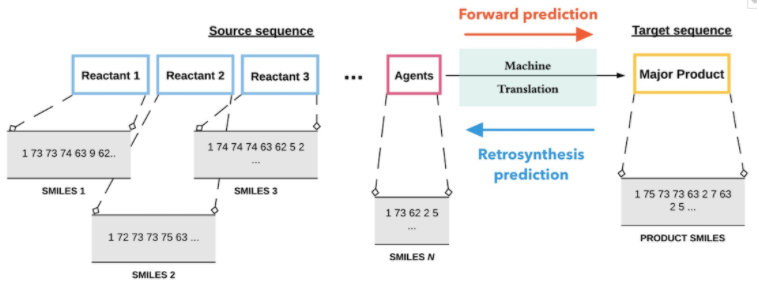

# Grammar Transformer Model for Forward and Retrosynthetic Chemical Reaction Prediction using SMILES

This repository is the official implementation of two papers:
> - [Predicting chemical reaction outcomes: A grammar ontology-based transformer framework](https://doi.org/10.1002/aic.17190)
> Discovering and designing novel materials is a challenging problem as it often requires searching through a combinatorially large space of potential candidates, typically requiring great amounts of effort, time, expertise, and money. The ability to predict reaction outcomes without performing extensive experiments is, therefore, important. Toward that goal, we report an approach that uses context-free grammar-based representations of molecules in a neural machine translation framework. This involves discovering the transformations from the source sequence (comprising the reactants and agents) to the target sequence (comprising the major product) in the reaction. The grammar ontology-based representation hierarchically incorporates rich molecular-structure information, ensures syntactic validity of predictions, and overcomes over-parameterization in complex machine learning architectures. We achieve an accuracy of 80.1% (86.3% top-2 accuracy) and 99% syntactic validity of predictions on a standard reaction dataset. Moreover, our model is characterized by only a fraction of the number of training parameters used in other similar works in this area.


>- [Retrosynthesis prediction using grammar-based neural machine translation: An information-theoretic approach](https://doi.org/10.1016/j.compchemeng.2021.107533)
>Retrosynthetic prediction is one of the main challenges in chemical synthesis because it requires a search over the space of plausible chemical reactions that often results in complex, multi-step, branched synthesis trees for even moderately complex organic reactions. Here, we propose an approach that performs single-step retrosynthesis prediction using SMILES grammar-based representations in a neural machine translation framework. Information-theoretic analyses of such grammar-representations reveal that they are superior to SMILES representations and are better-suited for machine learning tasks due to their underlying redundancy and high information capacity. We report the top-1 prediction accuracy of 43.8% (syntactic validity 95.6%) and maximal fragment (MaxFrag) accuracy of 50.4%. Comparing our model’s performance with previous work that used character-based SMILES representations demonstrate significant reduction in grammatically invalid predictions and improved prediction accuracy. Fewer invalid predictions for both known and unknown reaction class scenarios demonstrate the model’s ability to learn the underlying SMILES grammar efficiently.

> 
>
>*Figure 1: The grammar-based machine translation froamework for forward and retrosynthetic predictions*

>")
>
>*Figure 2: The context-free grammar-based tree for the SMILES representation of CC=C (propene)*


## Requirements

To install requirements:

```setup
pip install -r requirements.txt
```

>  You may need to set up a conda environment to install the RDKit cheminformatics package for processing molecules. Detailed installation information is available at [https://www.rdkit.org/docs/Install.html](https://www.rdkit.org/docs/Install.html)

## Datasets
The SMILES datasets for the forward and the retrosynthesis prediction tasks are available in the `datasets/forward` and `datasets/retro` folders, respectively. Run the script `data_generation.py` with appropriate hyperparameters for generating the grammar-based representations for these reactions for both the tasks as numpy arrays and store them in their respective directories as `.npz` files. 

```dataset generation
python data_generation.py
```


## Training and pre-trained models

To train the model(s) in the paper, the script train.py with the appropriate hyperparameters. Both the forward and the retrosynthesis prediction models could be trained using this script. The model weights for three pre-trained models are provided as TensorFlow checkpoints at the following locations:
* forward prediction: `pretrained_models/forward`
* retrosynthesis prediction with reaction class information: `pretrained_models/retro/noclass`
* retrosynthesis prediction without reaction class information: `pretrained_models/retro/withouclass`

```train
python train.py
```

>📋  Describe how to train the models, with example commands on how to train the models in your paper, including the full training procedure and appropriate hyperparameters.

## Evaluation

To evaluate my model on the given datasets, run the script `eval.py` with the appropriate hyperparameters and provide file path of the test dataset. The evaluation results would be print to the screen and also store in `.csv` files in the `results/forward` and `results/retro` folders for the forward and the retrosynthesis models, respectively. The list of metrics in these files are as below:
* forward: syntatctic validity, string-based similarity, accuracy, and BLEU score
* retro: 

```eval
python eval.py
```

## Results

Our model achieves the following performance on the USPTO datasets: 

*to be updated*


| Model name         | Top 1 Accuracy  | Top 2 Accuracy | Top 3 Accuracy |
| ------------------ |---------------- | -------------- |-------------- |
| Forward prediction |     -         |      -       |           -        |

| Model name         | Top 1 Accuracy  | Top 3 Accuracy | Top 5 Accuracy |
| ------------------ |---------------- | -------------- |-------------- |
| Retrosynthesis prediction |     -         |      -       |           -        |

## Citation
> If use this code in any manner, please cite the following papers:

- *Predicting chemical reaction outcomes: A grammar ontology-based transformer framework*, Vipul Mann, Venkat Venkatasubramanian, AIChE Journal, 67, 2021

- *Retrosynthesis prediction using grammar-based neural machine translation: An information-theoretic approach*, Vipul Mann, Venkat Venkatasubramanian, Computers & Chemical Engineering, 155, 2021