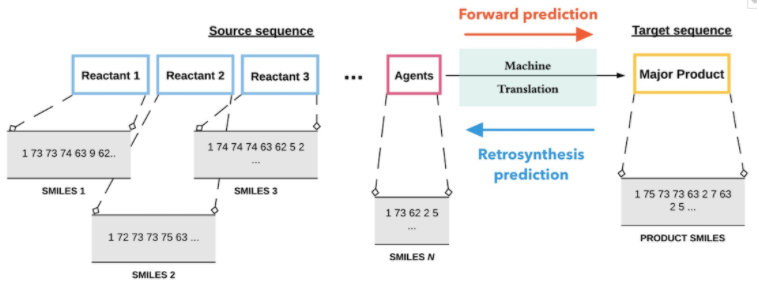

# Grammar Transformer Model for Chemical Reaction Prediction and Retrosynthetic Analysis using SMILES

This repository is the official implementation of two papers:
> - [Predicting chemical reaction outcomes: A grammar ontology-based transformer framework](https://doi.org/10.1002/aic.17190)
> Discovering and designing novel materials is a challenging problem as it often requires searching through a combinatorially large space of potential candidates, typically requiring great amounts of effort, time, expertise, and money. The ability to predict reaction outcomes without performing extensive experiments is, therefore, important. Toward that goal, we report an approach that uses context-free grammar-based representations of molecules in a neural machine translation framework. This involves discovering the transformations from the source sequence (comprising the reactants and agents) to the target sequence (comprising the major product) in the reaction. The grammar ontology-based representation hierarchically incorporates rich molecular-structure information, ensures syntactic validity of predictions, and overcomes over-parameterization in complex machine learning architectures. We achieve an accuracy of 80.1% (86.3% top-2 accuracy) and 99% syntactic validity of predictions on a standard reaction dataset. Moreover, our model is characterized by only a fraction of the number of training parameters used in other similar works in this area.


>- [Retrosynthesis prediction using grammar-based neural machine translation: An information-theoretic approach](https://doi.org/10.1016/j.compchemeng.2021.107533)
>Retrosynthetic prediction is one of the main challenges in chemical synthesis because it requires a search over the space of plausible chemical reactions that often results in complex, multi-step, branched synthesis trees for even moderately complex organic reactions. Here, we propose an approach that performs single-step retrosynthesis prediction using SMILES grammar-based representations in a neural machine translation framework. Information-theoretic analyses of such grammar-representations reveal that they are superior to SMILES representations and are better-suited for machine learning tasks due to their underlying redundancy and high information capacity. We report the top-1 prediction accuracy of 43.8% (syntactic validity 95.6%) and maximal fragment (MaxFrag) accuracy of 50.4%. Comparing our model’s performance with previous work that used character-based SMILES representations demonstrate significant reduction in grammatically invalid predictions and improved prediction accuracy. Fewer invalid predictions for both known and unknown reaction class scenarios demonstrate the model’s ability to learn the underlying SMILES grammar efficiently.

> \
>*Figure 1: The grammar-based machine translation froamework for forward and retrosynthetic predictions*

>") \
>*Figure 2: The context-free grammar-based tree for the SMILES representation of CC=C (propene)*


## Requirements

To install requirements:

```setup
pip install -r requirements.txt
```

>  You may need to set up a conda environment to install the RDKit cheminformatics package for processing molecules. Detailed installation information is available at [https://www.rdkit.org/docs/Install.html](https://www.rdkit.org/docs/Install.html)

## Training

To train the model(s) in the paper, run this command:

```train
python train.py --input-data <path_to_data> --alpha 10 --beta 20
```

>📋  Describe how to train the models, with example commands on how to train the models in your paper, including the full training procedure and appropriate hyperparameters.

## Evaluation

To evaluate my model on ImageNet, run:

```eval
python eval.py --model-file mymodel.pth --benchmark imagenet
```

>📋  Describe how to evaluate the trained models on benchmarks reported in the paper, give commands that produce the results (section below).

## Pre-trained Models

You can download pretrained models here:

- [My awesome model](https://drive.google.com/mymodel.pth) trained on ImageNet using parameters x,y,z. 

>📋  Give a link to where/how the pretrained models can be downloaded and how they were trained (if applicable).  Alternatively you can have an additional column in your results table with a link to the models.

## Results

Our model achieves the following performance on :

### [Image Classification on ImageNet](https://paperswithcode.com/sota/image-classification-on-imagenet)

| Model name         | Top 1 Accuracy  | Top 5 Accuracy |
| ------------------ |---------------- | -------------- |
| My awesome model   |     85%         |      95%       |

>📋  Include a table of results from your paper, and link back to the leaderboard for clarity and context. If your main result is a figure, include that figure and link to the command or notebook to reproduce it. 


## Citation
> If use this code in any manner, please cite the following papers:
- *Predicting chemical reaction outcomes: A grammar ontology-based transformer framework*, Vipul Mann, Venkat Venkatasubramanian, AIChE Journal, 67, 2021

- *Retrosynthesis prediction using grammar-based neural machine translation: An information-theoretic approach*, Vipul Mann, Venkat Venkatasubramanian, Computers & Chemical Engineering, 155, 2021